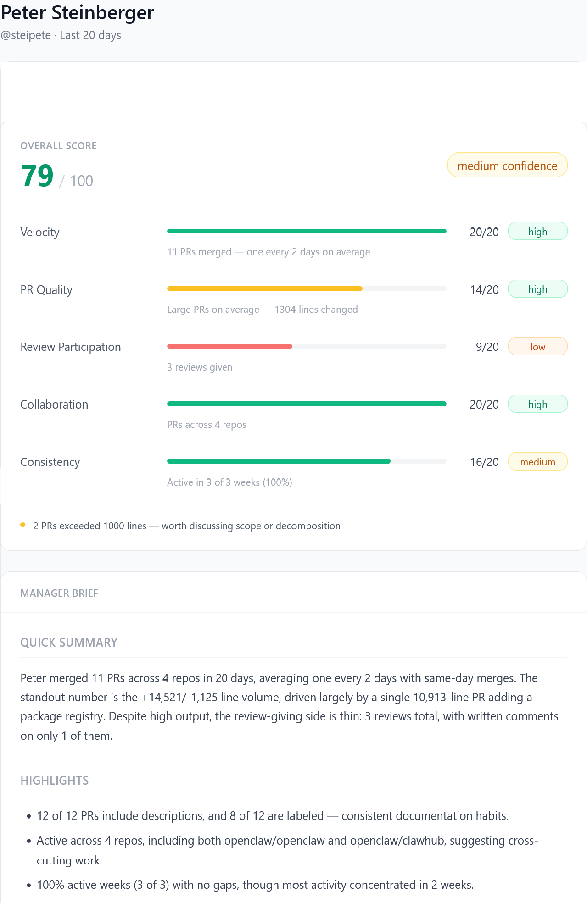

# PullStar 1-on-1

 Generate a ready-to-use 1-on-1 brief for any engineer on your team — from their GitHub activity, in seconds.
 Spots patterns like:
- High output but low review participation
- Large PR sizes suggesting batching
- Cross-repo collaboration signals
> 


> Example 1-on-1 brief generated from real GitHub activity (20-day window)
> 
PullStar fetches GitHub activity for one engineer (PRs authored, reviews given), runs a deterministic scoring engine across five dimensions, and calls your configured AI provider to generate a structured 1-on-1 preparation brief. All data stays on your machine.


---

## Requirements

- Python 3.11+
- Node.js 18+ (UI only)
- A GitHub **classic** personal access token with `repo` scope (recommended)
  - Create one at: <https://github.com/settings/tokens>
  - Fine-grained PATs do not support cross-user search — use a classic PAT
  - Unauthenticated access works but is rate-limited to 60 req/hr
- An AI provider key (required for `--mode local`; not needed for `--mode stub`)

---

## Installation

```bash
# 1. Clone
git clone https://github.com/pullstar-ai/pullstar
cd pullstar

# 2. Bootstrap (creates .venv, installs deps, copies config stubs)
./scripts/install.sh

# 3. Edit .env — add GITHUB_TOKEN and your AI provider key
# 4. Edit model_provider.json — set provider, model, temperature, max_tokens
```

Or manually:

```bash
python3 -m venv .venv && .venv/bin/pip install -e ".[ui]"
cd ui && npm install && cd ..
cp .env.example .env
cp model_provider.json.example model_provider.json
```

---

## Engine API (v0.2.0 — supported)

PullStar's analysis engine is packaged as `pullstar` (Python 3.11+).
The engine prepares deterministic input for external inference; **the caller
completely owns the inference step** — provider, model, credentials, and retries.

```bash
pip install pullstar          # engine only
pip install "pullstar[ui]"    # engine + Gradio demo (app.py)
```

### Quickstart

```python
from datetime import datetime, timezone
from pullstar.engine import prepare_1on1, finalize_1on1

start = datetime(2026, 7, 1, tzinfo=timezone.utc)
end   = datetime(2026, 8, 1, tzinfo=timezone.utc)

# 1. Prepare — deterministic ingest → score → prompt assembly
prepared = prepare_1on1(
    "jsmith",
    github_token="ghp_...",           # used only during ingest, never retained
    repositories=["org/api", "org/frontend"],  # optional; None = all accessible
    start_at=start,
    end_at=end,
    supplemental_context=[            # optional; engine does not interpret labels
        {"label": "Current Expectations",
         "content": "Take greater ownership of incident response."},
    ],
    # prompt_spec="brief_v1"          # override; default is brief_v2
)

# 2. Inference — caller's responsibility (any provider, model, or gateway)
completion = your_llm_client.complete(
    system=prepared.inference.system_prompt,
    user=prepared.inference.user_message,
)

# 3. Finalize — validate and package the result
result = finalize_1on1(prepared, completion)

print(result.markdown)       # Markdown brief
print(result.prompt_name)    # "brief_v2"
print(result.metadata)       # finalized_at, engineer_login, total_score, confidence
```

### Key contracts

| Contract | Detail |
|---|---|
| **Caller owns inference** | Engine does not call Anthropic, OpenAI, or any other provider. |
| **Explicit repository scope** | `repositories=["org/a", "org/b"]` — no other repos leak in. |
| **Exact UTC time window** | `start_at`/`end_at` passed unchanged to OSS-20 ingestion. |
| **Generic supplemental context** | `SupplementalContextBlock` dicts — engine ignores label semantics. |
| **Default prompt is brief_v2** | Engine default; pass `prompt_spec="brief_v1"` for reproducibility. |
| **No `.pullstar` artifacts** | Full engine flow requires no filesystem artifacts. |
| **No provider SDK required** | Engine imports only stdlib + requests + PyGithub. |
| **GitHub token not retained** | Token used during ingest only; absent from all returned objects. |

### PreparedInference fields

`prepared.inference` is the small, transport-friendly object to pass to inference:

| Field | Type | Description |
|---|---|---|
| `system_prompt` | `str` | Complete PullStar system prompt. |
| `user_message` | `str` | Engineer-specific user turn with scores, stats, and context. |
| `prompt_name` | `str` | Prompt identity for provenance (`"brief_v2"`, `"brief_v1"`, `"custom"`). |
| `metadata` | `dict` | Credential-free metadata: `generated_at`, `lookback_days`, `total_score`, `confidence`, `has_insights`, `has_supplemental_context`. |

### EngineResult fields

| Field | Type | Description |
|---|---|---|
| `markdown` | `str` | Inference completion, strip()-normalized. |
| `prompt_name` | `str` | Prompt provenance carried from preparation. |
| `structured` | `None` | Reserved for future structured output. Always `None` in v0.2.0. |
| `metadata` | `dict` | `finalized_at`, `engineer_login`, `total_score`, `confidence`. |

### Lower-level seams

For advanced use, lower-level APIs are also directly importable:

```python
from pullstar.ingest   import ingest_developer_activity
from pullstar.scoring  import score_profile
from pullstar.prompting import build_user_message, build_llm_input_payload
from pullstar.resources import resolve_brief_prompt
```

Importing `pullstar` is side-effect free: no network calls, no credential reads,
no files written, no UI launched.

---

## Legacy scripts (not supported for new integrations)

> **Note:** `scripts/` contains legacy CLI wrappers for the Gradio demo.
> New integrations should use the `pullstar.engine` API above.
> The scripts are preserved for existing Gradio demo users and are not modified.

---

## Configuration

> **Note:** This section covers configuration for the legacy Gradio demo
> (`scripts/` + `app.py`).  The v0.2.0 engine API (`pullstar.engine`) does not
> read `.env` or `model_provider.json` — it receives credentials as parameters
> from the caller.  Provider API keys are **not** engine dependencies.

### Secrets — `.env`

`.env` contains **secrets only**. Never commit it.

| Variable | Required | Description |
| --- | --- | --- |
| `GITHUB_TOKEN` | Recommended | Classic PAT with `repo` scope. Omit to use unauthenticated access (60 req/hr). |
| `GITHUB_ORG` | No | Scope ingestion to one org. Omit to search all accessible repos. |
| `ANTHROPIC_API_KEY` | Legacy scripts only | Anthropic API key (not used by the engine) |
| `OPENAI_API_KEY` | Legacy scripts only | OpenAI API key (not used by the engine) |
| `OPENROUTER_API_KEY` | Legacy scripts only | OpenRouter API key (not used by the engine) |
| `TOGETHER_API_KEY` | Legacy scripts only | Together AI API key (not used by the engine) |
| `HUGGINGFACE_API_KEY` | Legacy scripts only | HuggingFace API key (not used by the engine) |

Provider/model settings do **not** belong in `.env`. Use `model_provider.json` for those.

#### Credential lookup order

`GITHUB_TOKEN` is resolved in this order — first match wins:

1. `--github-token` CLI flag (override/debug only — never logged)
2. `GITHUB_TOKEN` environment variable
   - If a `.env` file exists in the repo root, it is loaded first, so `GITHUB_TOKEN` from `.env` is included in this step
3. `~/.pullstar/credentials` (central credentials file, `KEY=value` format)

For normal use, `.env` or `~/.pullstar/credentials` is recommended. If both are present, `.env` takes precedence because it is loaded into the environment-variable step before `~/.pullstar/credentials` is checked. The CLI flag is intended for one-off testing only.

### Provider/model config — `model_provider.json`

`model_provider.json` is gitignored and machine-local. It controls inference behavior for local mode.

```json
{
  "provider": "anthropic",
  "model": "claude-sonnet-4-6",
  "temperature": 0.2,
  "max_tokens": 1200
}
```

Supported providers: `anthropic`, `openai`, `openrouter`, `together`, `huggingface`

Copy `model_provider.json.example` to get started:

```bash
cp model_provider.json.example model_provider.json
```

---

## Local Mode

Run inference directly on your machine using your configured AI provider.

```bash
# One-liner (runs ingest → score → generate_brief automatically)
./scripts/run_local_brief.sh jsmith

# Then open the dashboard
./scripts/run_ui.sh
# open http://localhost:5173?login=jsmith
```

Or step by step:

```bash
python scripts/ingest.py --login jsmith
python scripts/score.py --login jsmith
python scripts/generate_brief.py --login jsmith --mode local
```

`ingest.py` optional flags:

```bash
python scripts/ingest.py --login jsmith --days 14         # narrower window (default: 30)
python scripts/ingest.py --login jsmith --max-results 20  # faster on high-activity users (default: 50)
```

Requires: `model_provider.json` + matching API key in `.env`

Writes:

- `.pullstar/ingest_jsmith.json`
- `.pullstar/score_jsmith.json`
- `.pullstar/llm_input_jsmith.json` (prompt payload, for debugging)
- `.pullstar/output_jsmith.json` (final — what the UI reads)

---

## Prompt versions

The system prompt is versioned by filename under
[`pullstar/prompts/`](pullstar/prompts/) and ships with the package. Pick one
with `--prompt` (on `generate_brief.py` or `agent_prepare_1on1.py`):

```bash
python scripts/generate_brief.py --login jsmith --mode local --prompt brief_v2
python scripts/generate_brief.py --login jsmith --mode local --prompt ./drafts/mine.txt
```

Default is `brief_v1`. A bare name selects the packaged version; pass a path
(`./mine.txt`) to load a local file. The version used is recorded as
`metadata.prompt` in `llm_input_{login}.json` and `prompt` in
`output_{login}.json` (`"custom"` for a file path).

**New prompts are welcome as pull requests** — add a `brief_*.txt` file (don't
edit an existing version in place). See
[`pullstar/prompts/README.md`](pullstar/prompts/README.md).

---

## Agent Mode

Use this mode when inference is performed by an external agent (e.g. OpenClaw or any custom workflow).

Flow

```bash
# 1. Ingest GitHub activity
python scripts/ingest.py --login jsmith

# 2. Score the profile
python scripts/score.py --login jsmith

# 3. Prepare the LLM input artifact (no AI call)
python scripts/agent_prepare_1on1.py --login jsmith

# 4. External agent reads .pullstar/llm_input_jsmith.json
#    and writes .pullstar/llm_output_jsmith.json with schema:
#    { "version": "1.0", "engineer_login": "jsmith", "brief": "## Quick Summary\n..." }

# 5. Finalize — merge agent output into final artifact
python scripts/agent_finalize_1on1.py --login jsmith

# 6. Open the dashboard
cd ui && npm run dev
# open http://localhost:5173?login=jsmith
```

Requires: no API keys for steps 3 and 5.

Writes:

- `.pullstar/ingest_jsmith.json`
- `.pullstar/score_jsmith.json`
- `.pullstar/llm_input_jsmith.json` (prompt payload the agent reads)
- `.pullstar/llm_output_jsmith.json` (agent must write this)
- `.pullstar/output_jsmith.json` (final — what the UI reads)

🔴 REQUIRED: JSON Contract

The external agent must strictly follow this contract.

Input (from PullStar)

.pullstar/llm_input_{login}.json

This file contains:
#### Input (from PullStar)
.pullstar/llm_input_{login}.json
This file contains:

system prompt
user prompt
metadata
Treat this as the canonical prompt payload
Do not modify its structure
#### Output (from agent)

.pullstar/llm_output_{login}.json

Must be valid JSON with the following shape:

{
  "version": "1.0",
  "engineer_login": "steipete",
  "brief": "## Quick Summary\n..."
}

#### ⚠️ Requirements

- Output must be valid JSON (no trailing commas, no markdown wrapping)
- brief must be a non-empty markdown string
- Do NOT return plain text, markdown files, or chat logs
- Do NOT change field names

## Stub Mode (dev/demo only)

Generate a deterministic brief from scored data without calling any AI. Useful for UI development and testing the pipeline.

```bash
python scripts/generate_brief.py --login jsmith --mode stub
```

No API key or `model_provider.json` required.

---

## Expected Artifacts
Must be valid JSON. The brief field must contain a non-empty markdown string. This file is the source of truth for the final manager brief in agent mode.
| File | Written by | Contains |
| --- | --- | --- |
| `ingest_{login}.json` | `ingest.py` | Raw GitHub activity, PR details, summary stats |
| `score_{login}.json` | `score.py` | Dimension scores (0–20 each), signals, flags |
| `llm_input_{login}.json` | `generate_brief.py` / `agent_prepare_1on1.py` | Canonical LLM prompt payload (system + user messages) |
| `llm_output_{login}.json` | External agent | Agent-produced brief (agent mode only) |
| `output_{login}.json` | `generate_brief.py` / `agent_finalize_1on1.py` | Final brief + scored profile (what the UI reads) |

All artifacts are written to `.pullstar/` — gitignored, never committed.

---

## PR Insights (optional enrichment)

Run `ingest.py` with `--pr_insights` to collect review and comment detail per PR. When present, this raw context is packaged into the LLM prompt so the model can reason about collaboration patterns.

```bash
python scripts/ingest.py --login jsmith --pr_insights
```

Adds ~3 API calls per PR (capped at 20 PRs). Search results are capped at 50 by default — use `--max-results` to adjust. Safe to omit for faster ingestion.

---

## 🔒 Privacy
PullStar is designed to be local-first and explicit about data usage.

#### Defualt Mode
- Only metadata and aggregated signals are used
- No raw PR descriptions, comments, or review text are sent to any LLM
  
#### --pr_insights mode (opt-in)

- Bounded raw PR context may be included:
- PR descriptions
- review text
- comment text (including bot messages)
- This data may be sent to the configured LLM provider or external agent

- This mode is intended for richer insight and is explicitly opt-in.
  
  ## 🚀 PullStar Pro (Early Access)

PullStar OSS focuses on private, local 1-on-1 prep.

We’re exploring a Pro version with:
- longitudinal insights across time
- team-level patterns
- coaching and pairing signals
- integrations (Slack, calendar, etc.)

If this is interesting, join the early access list via notion form:

👉 https://savory-step-9d7.notion.site/32fc2b5d4feb8054b937f54c753ff73b?pvs=105

We’re prioritizing feedback from engineering managers using the OSS version.
